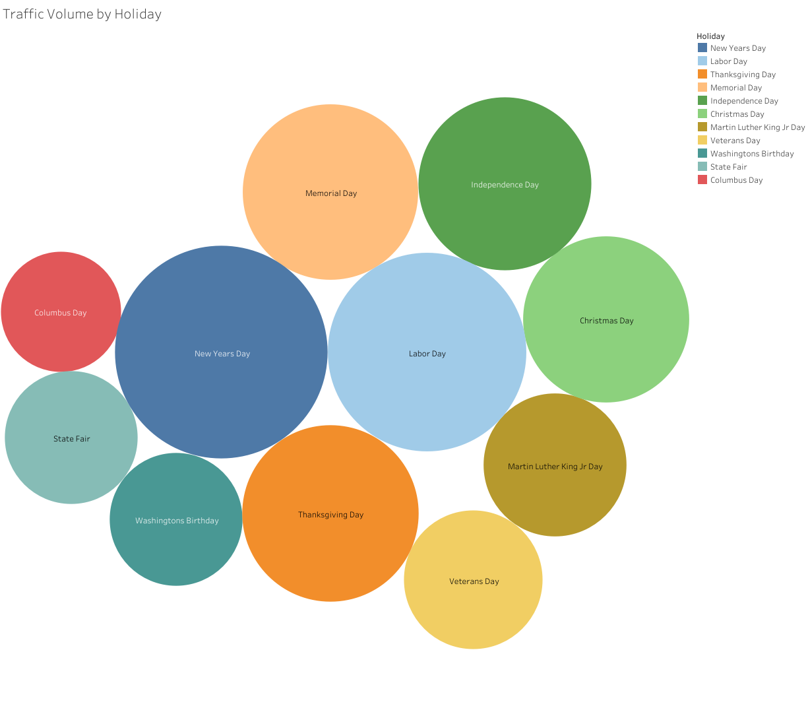

# Metro Interstate Traffic Volume Study

**Analyzing Traffic Patterns for Optimized Infrastructure Planning**  
This project explores traffic volume across days, holidays, and weather conditions to guide decisions on infrastructure improvements and traffic management.

### [Live Dashboard](https://public.tableau.com/views/TrafficVolume-HighwayInfrastructureStudy/TrafficVolumevs_WeatherConditions?:language=en-US&:sid=&:redirect=auth&:display_count=n&:origin=viz_share_link)

---

## Executive Summary & Key Findings

---

### Key Insights: Understanding Traffic Behavior

Our analysis highlights critical factors influencing traffic patterns:

1. **Peak Traffic Periods**:
   - Identified high-traffic days for targeted management.
   - Strategic scheduling to optimize flow.

2. **Weather Impacts**:
   - Clear correlation between adverse weather and decreased traffic.
   - Resource allocation recommendations during severe conditions.
  

3. **Holiday Traffic Trends**:
   - Notable spikes during holidays, most notably New Years Day, Labor Day, Independence Day, Memorial Day, Thanksgiving Day, and Christmas Day.
   - Improved planning for holiday-specific demands.

### Business Impact
- **Goal**: Enhance traffic flow efficiency and minimize congestion.
- **Potential Outcome**: Reduced travel times and improved safety.
- **Strategic Focus**: Align infrastructure planning with traffic patterns.

---

## Project Documentation

### Business Intelligence Documents
- [Strategy Document](https://github.com/mslawsky/traffic-volume-study/raw/main/strategy-document-traffic-volume.pdf) (PDF)
- [Stakeholder Requirements](https://github.com/mslawsky/traffic-volume-study/raw/main/stakeholder-requirements-traffic-volume.pdf) (PDF)
- [Project Requirements](https://github.com/mslawsky/traffic-volume-study/raw/main/project-requirements-traffic-volume.pdf) (PDF)
- [Dashboard Mockup](https://github.com/mslawsky/traffic-volume-study/raw/main/traffic-volume-mockup.png) (Image)

### Data Analysis Process

📂 **Data File**  
- [Traffic Data: Metro Interstate](https://github.com/mslawsky/traffic-volume-study/raw/main/metro-interstate-traffic-volume.csv)

---

## Dashboard Development

1. **Data Integration & Cleaning**
   - Unified and validated datasets
   - Addressed missing and inconsistent entries
   - Tools utilized included BigQuery, ETL, Python (Pandas, NumPy), and SQL

2. **Metric Development**
   - Traffic volume by day
   - Weather condition impact analysis
   - Holiday-specific trends

3. **Visualization Strategy**
   - Temporal trends: Line Chart
This chart captures changes in traffic volume over time, offering insights into seasonal patterns and daily variations. Users can filter the data by day, week, month, and year, allowing for detailed trend analysis tailored to specific time frames.

   - Weather condition correlations: Horizontal Bar Chart
This chart highlights the relationship between traffic volume and various weather conditions, with each bar corresponding to a different weather category (e.g., clear, cloudy, rainy.) This visualization helps stakeholders identify weather patterns that significantly impact traffic flow, aiding in forecasting and planning.

   - Holiday-based patterns: Bubble Chart
This bubble chart visualizations traffic volume variations across different holidays. Each bubble is proportional to the traffic volume recorded on that day, allowing stakeholders to quickly identify holidays with unusually high traffic or low traffic and better prepare for such fluctuations.

### Implementation Recommendations

1. **Immediate Actions**
   - Optimize infrastructure during peak periods.
   - Allocate resources based on weather and holiday trends.

2. **Resource Optimization**
   - Traffic flow modeling for high-volume days.
   - Enhanced public communication during adverse conditions.

---

## Contact

For inquiries about this analysis:
- [LinkedIn Profile](https://www.linkedin.com/in/melissaslawsky/)
- [Professional Website](https://melissaslawsky.com/client-results/)
- [Tableau Portfolio](https://public.tableau.com/app/profile/melissa.slawsky1925/vizzes)
- [Email](mailto:melissa@melissaslawsky.com)

---

© Melissa Slawsky 2024. All Rights Reserved.  
This repository contains proprietary analysis.

**Published Project URL**: [Metro Interstate Traffic Volume Dashboard](https://public.tableau.com/views/TrafficVolume-HighwayInfrastructureStudy/TrafficVolumevs_WeatherConditions?:language=en-US&:sid=&:redirect=auth&:display_count=n&:origin=viz_share_link)
